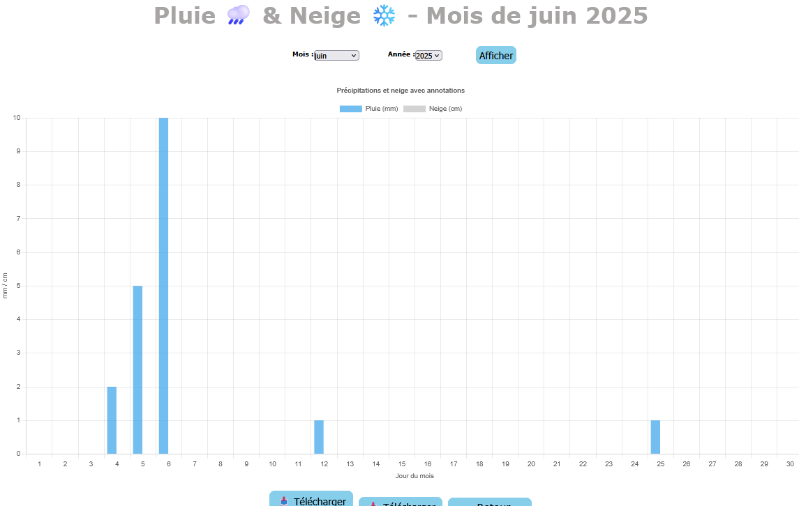
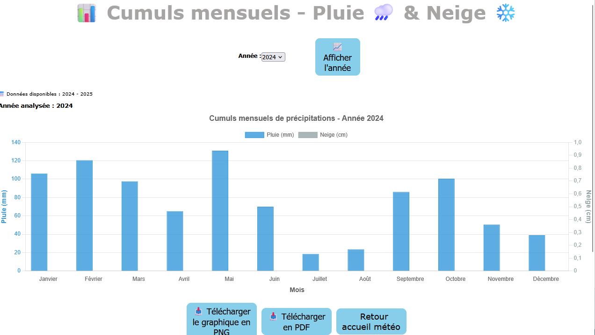
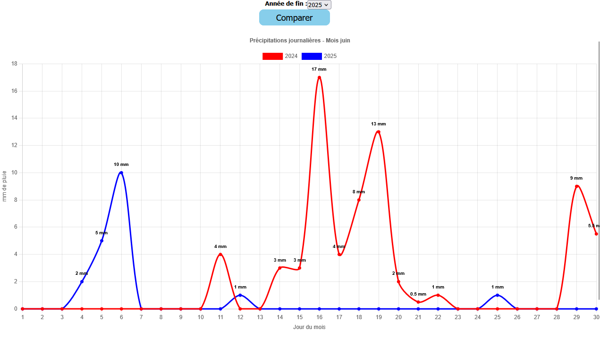
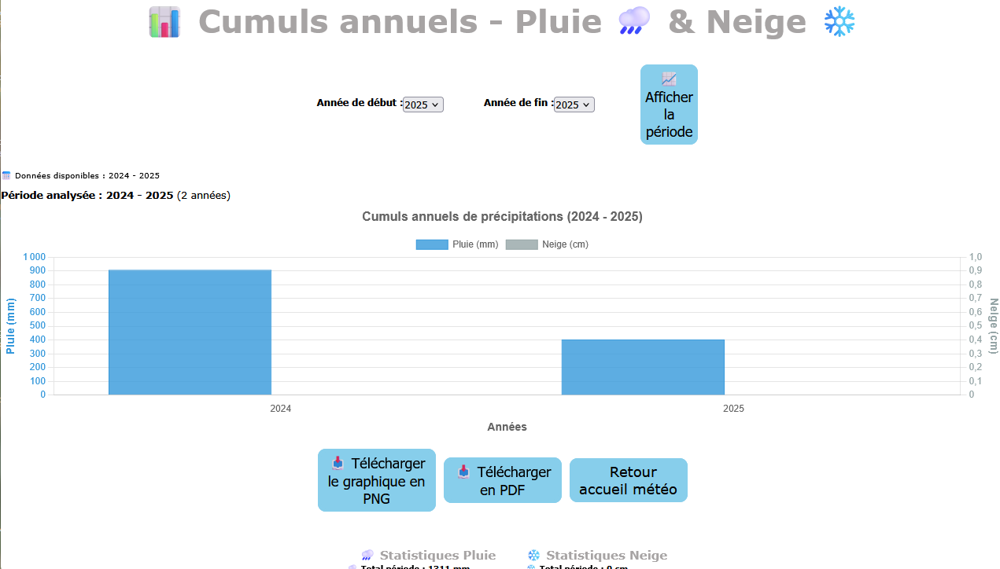
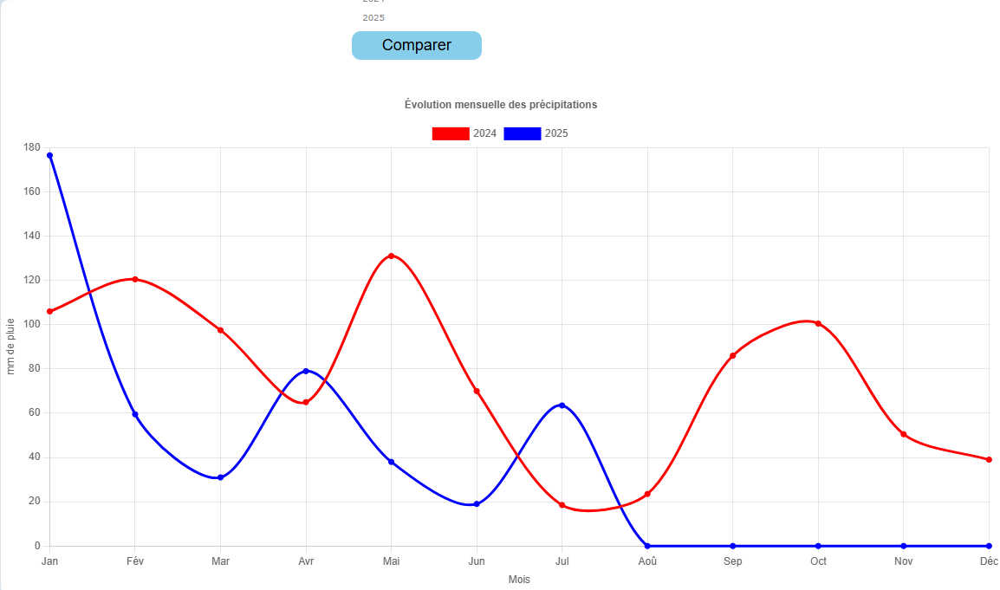
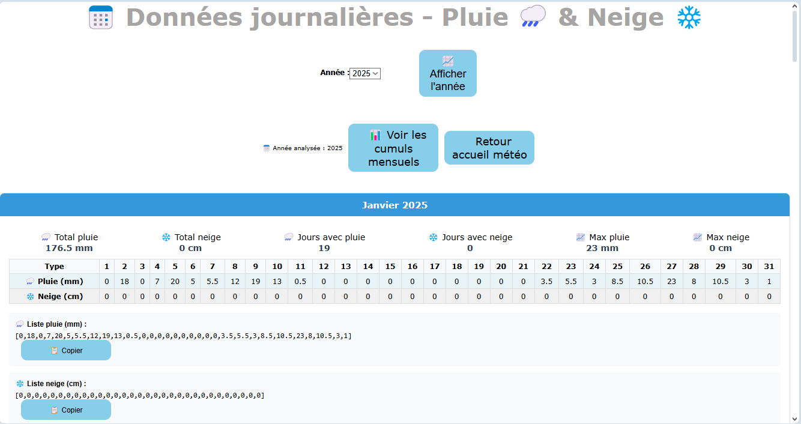

# 🌧️ Graphiques dynamiques avec Chart.js ❄️

## 1. 📊 Objectifs de ce projet

Améliorations de mes graphiques de précipitations.<br>
- Dynamique et responsif.
- Données à partir de la base de données.
- Découverte de la librairie `Chart.js`.
<br /><br />

## 2. 👩‍💻 Conception

- Ajout d'une table pour le relevé journalier des jours avec pluie et/ou neige avec possibilité de saisir un commentaire (orage, grêle,...).
- Ajout d'un graphique comparatif d'un mois entre différentes années.
- Ajout d'un graphique comparatif entre différentes années.
- Curseur interactif avec relevé de pluie et/ou de neige, commentaire.
- Téléchargement des graphiques en PNG ou PDF, avec inclusion des statistiques en PDF.
- Ajout de statistiques (moyenne, maximum, minimum).
- Ajout de tableaux statistiques.

## 3. 🛠️ Technologies utilisées : 
<a href="https://en.wikipedia.org/wiki/HTML5" target="_blank"></a>
<a href="https://www.w3schools.com/css/" target="_blank"></a>
<a href="https://www.php.net/" target="_blank"></a>
<a href="https://www.mysql.com/" target="_blank"></a>
<a href="https://www.javascript.com/" target="_blank"></a>
<a href="https://www.chartjs.org/" target="_blank"></a>
<a href="https://code.visualstudio.com/" target="_blank"></a>
<a href="https://httpd.apache.org" target="_blank"></a>  

## 4. Détail des pages :

### a. Histogramme d'un mois
- Histogramme avec 2 barres du mois sélectionné de pluie et de neige
- Statistiques : 
  - 🌧️ Total pluie (mm)
  - 📊 Moyenne quotidienne pluie (mm)
  - 📈 Pluie max (mm)
  - 📉 Pluie min (mm)
  - ❄️ Total neige (cm)
  - 📊 Moyenne neige (cm)
  - 📈 Neige max (cm)
  - 📉 Neige min (cm)
  
### b. Courbes mensuelles comparatives de pluie
- Courbes d'un mois pour plusieurs années
- Courbes pour chaque année
- Limitation de l'affichage à 7 années
- Conseil : Sélectionnez 3-5 années pour une meilleure lisibilité
- 📈 Statistiques : 
  - 🌧️ Cumul moyen mensuel (mm)
  - 📊 Médiane journalière (mm)
- 🏆 Records :
  - 🌧️ Année la plus pluvieuse et (mm)
  - ⛱️Année la plus sèche et (mm)
  - Record journalier (mm)
  - Date du record
- 📅Tableau de détails par Année
  - Cumul (mm)
  - Moyenne/jour (mm)
  - Jours de pluie
  - Maximum (mm)
  - % du mois pluvieux

### c. Cumuls mensuels
- Histogramme avec 2 barres du mois sélectionné de pluie et de neige
- Statistiques : 
  - 🌧️ Total annuel (mm)
  - 📊 Moyenne mensuelle (mm)
  - 📈 Maximum (mm) (mois)
  - 📉 Minimum (mm) (mois)
  - ❄️ Total annuel (cm)
  - 📊 Moyenne mensuelle (cm)
  - 📈 Maximum (cm) (mois)
  - 📉 Minimum (cm) (mois)

### d. Cumuls annuels
- Histogramme avec 2 barres par années sélectionnées de pluie et de neige
- Statistiques : 
  - 🌧️ Total période (mm)
  - 📊 Moyenne annuelle (mm)
  - 📈 Maximum (mm) (mois)
  - 📉 Minimum (mm) (mois)
  - ❄️ Total période (cm)
  - 📊 Moyenne annuelle (cm)
  - 📈 Maximum (cm) (mois)
  - 📉 Minimum (cm) (mois) 

### e. Courbes annuelles comparatives de pluie
- Courbes sur 12 mois pour plusieurs années
- Courbes pour chaque année
- Limitation de l'affichage à 7 années
- Conseil : Sélectionnez 3-5 années pour une meilleure lisibilité
- 📈 Statistiques : 
  - 🌧️ Cumul moyen annuel (mm)
- 🏆 Records :
  - 🌧️ Année la plus pluvieuse et (mm)
  - ⛱️Année la plus sèche et (mm)
  - Ecart (mm)
- 📅Tableau de détails par Année
  - Total annuel (mm)
  - Moyenne mensuelle (mm)
  - Jours de pluie
  - Maximum journalier (mm)
  - Ecart à la moyenne
- 📅Tableau des moyennes Mensuelles sur la Période
  - Mois
  - Différentes années (mm)
  - Moyenne (mm)
### f. Données journalières par mois
Je me suis apperçu qu'il me manquait les histogrammes en images pour les années 2018 et 2019.
- J'ai créé une nouvelle pages avec les données journalières par mois pour une année sous forme de tableaux et de listes.
- Les listes m'ont permis de les générer en Pyton comme 2024 et 2025.
- 📈 Statistiques pour chaque mois : 
  - 🌧️ Total pluie (mm)
  - ❄️ Total neige (cm)
  - 🌧️ Jours avec pluie
  - ❄️ Jours avec neige
  - 📈 Max pluie (mm)
  - 📈 Max neige (cm)
- 📅Tableau journalier
  - 🌧️ Pluie (mm)
  - ❄️ Neige (cm)
- 🗒️Liste sous cette forme :
  - 🌧️ Liste pluie (mm) :
[0,18,0,7,20,5,5.5,12,19,13,0.5,0,0,0,0,0,0,0,0,0,0,3.5,5.5,3,8.5,10.5,23,8,10.5,3,1]<br>
  - ❄️ Liste neige (cm) :
[0,0,0,0,0,0,0,0,0,0,0,0,0,0,0,0,0,0,0,0,0,0,0,0,0,0,0,0,0,0,0]<br>
  - Avec des boutons pour copier les listes
<br />

## 🔗 5. Voici les liens :

| 📄 Page                         | 🔗 Lien                                                                 | 📝 Description                                             |
| ------------------------------- | ----------------------------------------------------------------------- | ---------------------------------------------------------- |
| Histogramme d’un mois           | <a href="http://nelly.babin.free.fr/meteo/dynamique.php" target="_blank">Voir la page</a>          | Histogramme pluie/neige pour un mois donné                 |
| Courbes mensuelles comparatives | <a href="http://nelly.babin.free.fr/meteo/comparaison.php" target="_blank">Voir la page</a>        | Comparaison de la pluie sur un mois entre plusieurs années |
| Cumuls mensuels                 | <a href="http://nelly.babin.free.fr/meteo/cumuls_mensuels.php" target="_blank">Voir la page</a>    | Cumuls pluie/neige par mois sur une année                  |
| Cumuls annuels                  | <a href="http://nelly.babin.free.fr/meteo/cumuls_annuels.php" target="_blank">Voir la page</a>     | Cumuls pluie/neige par année sur une période               |
| Courbes annuelles comparatives  | <a href="http://nelly.babin.free.fr/meteo/comparaison-annuel.php" target="_blank">Voir la page</a> | Comparaison annuelle de la pluie sur 12 mois               |
| Données journalières par mois  | <a href="http://nelly.babin.free.fr/meteo/donnees_journalieres.php" target="_blank">Voir la page</a> | Données journalières par mois pour une année              |
<br />

## 6. 🖥️ Captures d'écrans : 

🎴Ecran des nouveaux graphiques :<br />
- Histogramme d'un mois

- Cumuls mensuels
  
- Courbes mensuelles comparatives de pluie de plusieurs années

- Cumuls annuels

- Courbes annuelles comparatives de pluie de plusieurs années

- Données journalières par mois pour une année

<br /><br />

## 7. 🧩 Codes spécifiques utilisés
Cette section présente les extraits de code essentiels pour l’intégration des graphiques dynamiques avec `Chart.js`, ainsi que les personnalisations apportées pour enrichir l’interactivité et la lisibilité.

### a. Importation des librairies
```
<!-- Chart.js -->
<script src="https://cdn.jsdelivr.net/npm/chart.js"></script>
<!-- Plugin pour l'affichage des données sur les barres -->
<script src="https://cdn.jsdelivr.net/npm/chartjs-plugin-datalabels@2"></script>
```
### b. Insertion du graphique dans la page
```
<div style="margin: 20px 0;">
  <canvas id="chart" width="100%" height="500"></canvas>
</div>
```
### c. Types de graphiques utilisés
```
type: 'bar'   // Pour les histogrammes
type: 'line'  // Pour les courbes comparatives
```
### d. Tooltips avec commentaires dynamiques
Affichage de commentaires personnalisés (orage, grêle...) au survol des données :

```
tooltip: {
  mode: 'index',
  intersect: false,
  callbacks: {
    afterBody: function(context) {
      const index = context[0].dataIndex;
      const com = commentaires[index];
      return com ? '📝 ' + com : '';
    }
  }
}
```
### e. Création dynamique de plusieurs datasets
Exemple `PHP` + `JavaScript` pour générer plusieurs courbes selon les années sélectionnées :

```
const datasetsMensuel = [
  <?php
  $i = 0;
  foreach ($annees_valides as $annee) {
      echo "{ label: '$annee', data: [";
      for ($mois = 1; $mois <= 12; $mois++) {
          $valeur = $donnees_mensuelles[$annee][$mois];
          echo number_format($valeur, 1) . ($mois < 12 ? ',' : '');
      }
      $couleur = $couleurs[$i % count($couleurs)];
      echo "], borderColor: '$couleur', backgroundColor: '$couleur', fill: false, tension: 0.3 },";
      $i++;
  }
  ?>
];
```
### f. Configuration du graphique
Exemple du graphique de comparaison des Années :
```
const configMensuel = {
  type: 'line',
  data: {
      labels: labelsMois,
      datasets: datasetsMensuel
  },
  options: {
      responsive: true,
      animation: { duration: 0 },
      plugins: {
          title: {
              display: true,
              text: "Évolution mensuelle des précipitations"
          },
          tooltip: {
              mode: 'index',
              intersect: false,
              callbacks: {
                  label: function(context) {
                      return context.dataset.label + ': ' + context.parsed.y + ' mm';
                  }
              }
          }
      },
      scales: {
          y: {
              beginAtZero: true,
              title: {
                  display: true,
                  text: "mm de pluie"
              }
          },
          x: {
              title: {
                  display: true,
                  text: "Mois"
              }
          }
      }
  }
};
```
### g. Export du graphique en PDF avec jsPDF
📥 <b>Importation de la librairie `jsPDF` : </b>
```
<script src="https://cdnjs.cloudflare.com/ajax/libs/jspdf/2.5.1/jspdf.umd.min.js"></script>

```
🧾 <b>Fonction JavaScript pour générer et télécharger le PDF : </b>
```
function downloadPDF() {
    console.log('PDF function called');
    try {
        const { jsPDF } = window.jspdf;
        const pdf = new jsPDF();

        // Titre principal
        pdf.setFontSize(16);
        pdf.text('Precipitations & Neige - <?php echo $moisLibelle . " " . $annee; ?>', 20, 20);

        // Graphique depuis le canvas
        const canvas = document.getElementById('chart');
        const imgData = canvas.toDataURL('image/png');
        pdf.addImage(imgData, 'PNG', 15, 30, 180, 100);

        // Statistiques
        let yPos = 145;
        pdf.setFontSize(12);
        pdf.setFont(undefined, 'bold');
        pdf.text('Statistiques générales :', 20, yPos);

        yPos += 8;
        pdf.setFontSize(10);
        pdf.setFont(undefined, 'normal');
        pdf.text('Total pluie : <?php echo $totalPluie; ?> mm', 25, yPos); yPos += 6;
        pdf.text('Total neige : <?php echo $totalNeige; ?> cm', 25, yPos); yPos += 6;
        pdf.text('Moyenne pluie : <?php echo $avgPluie; ?> mm/jour', 25, yPos); yPos += 6;
        pdf.text('Moyenne neige : <?php echo $avgNeige; ?> cm/jour', 25, yPos);

        // Extrêmes
        yPos += 10;
        pdf.setFontSize(12);
        pdf.setFont(undefined, 'bold');
        pdf.text('Extrêmes :', 20, yPos);

        yPos += 8;
        pdf.setFontSize(10);
        pdf.setFont(undefined, 'normal');

        <?php if ($aPluie): ?>
        pdf.text('Maximum pluie : <?php echo $maxPluie; ?> mm (le <?php echo $jourMaxPluie; ?>)', 25, yPos); yPos += 6;
        pdf.text('Minimum pluie : <?php echo $minPluie; ?> mm (le <?php echo $jourMinPluie; ?>)', 25, yPos); yPos += 6;
        <?php else: ?>
        pdf.text('Maximum pluie : 0 mm (aucune pluie)', 25, yPos); yPos += 6;
        pdf.text('Minimum pluie : 0 mm (aucune pluie)', 25, yPos); yPos += 6;
        <?php endif; ?>

        <?php if ($aNeige): ?>
        pdf.text('Maximum neige : <?php echo $maxNeige; ?> cm (le <?php echo $jourMaxNeige; ?>)', 25, yPos); yPos += 6;
        pdf.text('Minimum neige : <?php echo $minNeige; ?> cm (le <?php echo $jourMinNeige; ?>)', 25, yPos); yPos += 6;
        <?php else: ?>
        pdf.text('Maximum neige : 0 cm (aucune neige)', 25, yPos); yPos += 6;
        pdf.text('Minimum neige : 0 cm (aucune neige)', 25, yPos); yPos += 6;
        <?php endif; ?>

        // Date en bas de page
        pdf.setFontSize(8);
        pdf.setFont(undefined, 'italic');
        pdf.text('Généré le ' + new Date().toLocaleDateString('fr-FR'), 20, 285);

        // Sauvegarde du fichier
        pdf.save('precipitations_neige_<?php echo $mois . "_" . $annee; ?>.pdf');
        console.log('PDF download completed');

    } catch (error) {
        console.error('Erreur PDF:', error);
        alert('Erreur : ' + error.message);
    }
}
```
📥 <b>Bouton d’export PDF :</b> <br>
Voici le bouton déclenchant la génération du fichier PDF à partir du graphique et des données :
```
<button onclick="downloadPDF()" class="boutonMeteo">📥 Télécharger en PDF</button>
```
### h. Interface utilisateur : Sélection dynamique d’années
Cette interface permet à l’utilisateur de sélectionner les années à comparer (jusqu’à 7), avec une indication visuelle des cases cochées et un conseil UX :

```
<div class="containerMenu">
  <form method="get">
    <label class="A1">Sélectionnez les années à comparer (7 maximum) :</label>
    <div class="selection-annees">
      <?php
      foreach ($listeAnneesDisponibles as $a) {
          $checked = in_array($a, $annees_valides) ? 'checked' : '';
          $class_checked = in_array($a, $annees_valides) ? 'checked' : '';
          echo "<div class='annee-checkbox $class_checked'>";
          echo "<input type='checkbox' name='annees[]' value='$a' id='annee_$a' $checked onchange='limitSelection(this)'>";
          echo "<label for='annee_$a'>$a</label>";
          echo "</div>";
      }
      ?>
    </div>
    💡 Conseil : Sélectionnez 3-5 années pour une meilleure lisibilité<br /><br />
    <button type="submit" class="boutonMeteo">Comparer</button>
  </form>
</div>
```
🧾 <b>Fonction `JavaScript` pour limiter à 7 sélections maximum :</b>
```
function limitSelection(currentCheckbox) {
  const checkedBoxes = document.querySelectorAll('.annee-checkbox input[type="checkbox"]:checked');
  
  if (currentCheckbox.checked && checkedBoxes.length > 7) {
      currentCheckbox.checked = false;
      alert('Vous ne pouvez sélectionner que 7 années maximum.');
  }    
  updateCheckboxStyle(currentCheckbox);
}
```
### i. Copie de liste en Javascript
```
function copierListe(texte, type) {
    if (navigator.clipboard && navigator.clipboard.writeText) {
        navigator.clipboard.writeText(texte).then(function() {
            alert('Liste ' + type + ' copiée dans le presse-papiers !');
        }).catch(function(err) {
            console.log('Erreur lors de la copie : ', err);
            // Fallback vers méthode manuelle
            afficherTextePourCopie(texte, type);
        });
    } else {
        afficherTextePourCopie(texte, type);
    }
}
```
```        
function afficherTextePourCopie(texte, type) {
    var message = 'Copiez cette liste ' + type + ' :\n\n' + texte;
    
    var textarea = document.createElement('textarea');
    textarea.value = texte;
    document.body.appendChild(textarea);
    
    try {
        textarea.select();
        var reussi = document.execCommand('copy');
        document.body.removeChild(textarea);
        
        if (reussi) {
            alert('Liste ' + type + ' copiée dans le presse-papiers !');
        } else {
            alert(message);
        }
    } catch (err) {
        document.body.removeChild(textarea);
        alert(message);
    }
}

if (document.addEventListener) {
    document.addEventListener('DOMContentLoaded', ajouterBoutonsCopie);
} else if (document.attachEvent) {
    document.attachEvent('onreadystatechange', function() {
        if (document.readyState === 'complete') {
            ajouterBoutonsCopie();
        }
    });
}
```
```       
function ajouterBoutonsCopie() {
    var listes = document.getElementsByClassName ? 
        document.getElementsByClassName('liste-donnees') : 
        document.querySelectorAll('.liste-donnees');
    
    for (var i = 0; i < listes.length; i++) {
        var liste = listes[i];
        var texte = liste.textContent || liste.innerText;
        var texteArray = texte.split(':');
        if (texteArray.length > 1) {
            var donnees = texteArray[1].replace(/^\s+|\s+$/g, ''); // trim
            var type = texte.indexOf('pluie') !== -1 ? 'pluie' : 'neige';
            
            var bouton = document.createElement('button');
            bouton.innerHTML = '&#128203; Copier';
            bouton.className = 'boutonMeteo';
            bouton.style.marginLeft = '10px';
            bouton.style.fontSize = '12px';
            bouton.style.padding = '5px 10px';            
            bouton.onclick = (function(data, typeData) {
                return function() {
                    copierListe(data, typeData);
                };
            })(donnees, type);
            
            liste.appendChild(bouton);
        }
    }
}
```
<br />

## 8. 🧩 Codes Python pour générer les requuêtes SQL pour insérer les données de la table precipitations

### a. Origines des données
- Depuis 2024, les rélevés sont saisis sur les fichiers `graphes_précipitations_2024.ipynb` et `graphes_précipitations_2025.ipynb`
- Les années précédentes, les rélevés étaient saisis dans des fichiers Works .wks. Je les ai transformés en fichier .csv à l'aide de LibreOffice. 

### b. Codes pour créer des fichiers .sql
- Pour extraire les données des fichiers Python, j'ai ajouté le code suivant aux fichiers <a href="https://github.com/nelbab/python-histogrammes/blob/main/precipitation-2024/graphes_precipitations_2024.ipynb?short_path=bfc3bd6" target="_blank" title="Fichier graphes_précipitations_2024">`graphes_précipitations_2025.ipynb`</a>et <a href="https://github.com/nelbab/python-histogrammes/blob/main/precipitation-2025/graphes_precipitations_2025.ipynb?short_path=827828e" target="_blank" title="Fichier graphes_précipitations_2025">`graphes_précipitations_2025.ipynb`</a> :
```
def generer_insertions_mysql(annee, donnees_precipitations):

    insertions = []
    
    for mois, valeurs in donnees_precipitations.items():
        for jour, quantite in enumerate(valeurs, 1):
            # Ignorer les jours sans précipitations
            if quantite == 0:
                continue
                
            # Créer la date
            date_str = f"{annee}-{mois:02d}-{jour:02d}"
            
            # Commentaire vide - vous les ajouterez manuellement
            commentaire = ""
            
            # Créer la requête INSERT
            insertion = f"('{date_str}', {quantite}, 0.0, '{commentaire}')"
            insertions.append(insertion)
    
    return insertions

def generer_fichier_sql(annee, donnees_precipitations, nom_fichier="insertions_precipitations.sql"):

    insertions = generer_insertions_mysql(annee, donnees_precipitations)
    
    with open(nom_fichier, 'w', encoding='utf-8') as f:
        f.write("-- Insertions des données de précipitations\n")
        f.write(f"-- Généré automatiquement pour l'année {annee}\n\n")
        f.write("INSERT INTO precipitations (date, quantite_mm, neige_cm, commentaire) VALUES\n")
        
        for i, insertion in enumerate(insertions):
            if i == len(insertions) - 1:
                f.write(f"{insertion};\n")  # Dernière ligne avec point-virgule
            else:
                f.write(f"{insertion},\n")
    
    print(f"Fichier SQL généré: {nom_fichier}")
    print(f"{len(insertions)} insertions créées")

def traiter_precipitations(annee):

    # Récupérer automatiquement toutes vos variables y1, y2, etc.
    donnees = {}
    
    # Chercher les variables y1, y2, etc.
    import inspect
    frame = inspect.currentframe()
    try:
        variables_globales = frame.f_back.f_globals
        for var_name, var_value in variables_globales.items():
            if var_name.startswith('y') and var_name[1:].isdigit():
                mois = int(var_name[1:])
                if isinstance(var_value, list):
                    donnees[mois] = var_value
    finally:
        del frame
    
    print(f"Données trouvées pour {len(donnees)} mois:")
    for mois in sorted(donnees.keys()):
        jours_avec_pluie = sum(1 for x in donnees[mois] if x > 0)
        print(f"   y{mois}: {len(donnees[mois])} jours total, {jours_avec_pluie} jours avec pluie")
    
    # Générer le fichier SQL
    generer_fichier_sql(annee, donnees)
    
    return donnees
```
- Pour extraire les données des fichiers .csv, j'ai créé ce fichier `Python` `precipitations_import.sql`, <a href="https://github.com/nelbab/python-histogrammes/blob/main/meteo/meteo_converter.ipynb?short_path=e3cb779" target="_blank" title="Fichier meteo_converter">accessible ici</a>. <br>
Ce code me permet d'ouvrir les fichiers et de traiter les données présentes.

### c. Insersion dans la table precipitations
Après avoir généré ces 3 fichiers .sql, j'ai pu inserer les données dans ma table `precipitations` à l'aide des requêtes :
```
INSERT INTO precipitations (date, quantite_mm, neige_cm, commentaire) VALUES ...
```
🎗️ Toutes les données ont été intégrées avec succès.
<br /><br />

## 9. 🎯 Conclusion

Ce projet m’a permis d’explorer en profondeur les possibilités offertes par `Chart.js` pour créer des <b>graphiques de précipitations dynamiques, interactifs et esthétiques</b>. Grâce à l’intégration des <b>données issues d’une base de données</b>, les visualisations sont désormais actualisées en temps réel. L’ajout d’un graphique comparatif, d’un curseur interactif ainsi que de les fonctions de téléchargement au format PNG et en PDF <b>enrichissent l’expérience utilisateur et améliorent la lisibilité des données</b>.

En somme, ce projet a été une excellente opportunité pour :

- Apprendre à manipuler `Chart.js` de manière avancée.
- Rendre mes visualisations plus attractives et fonctionnelles.
- Manipuler les données de ma base `MySQL`.
- Manipuler des statistiques.